# Generating metadata

In your Episerver solution, image files are stored as any other content in the database. Take this example from the Alloy demo site.

``` C#
namespace Alloy.Models.Media
{
    [ContentType]
    [MediaDescriptor(ExtensionString = "jpg,jpeg,jpe,ico,gif,bmp,png")]
    public class ImageFile : ImageData
    {
    
    }
}
```

## Adding attributes
The metadata you want to automatically generate are added as properties to this content type, and the properties are then decorated with specific attributes that will populate the properties with data when images are uploaded.

Each attribute will handle one type of metadata. Some attributes may be added to several types of properties (i.e. both string and bool). The same attributes may be used more than once. The module includes [different attributes](Attributes.md), but you can easily [add your own inheriting from the provided base class](./attributes/CustomAttribute.md).

A simple example. Adding the AnalyzeImageForDescription-attribute to a property will get a description/caption that describes the image. This may be used as an alt text for images. The property gets its value when the image is uploaded. The value may then be checked, and (if necessary) adjusted by the editor. As the metadata is only generated when the file is uploaded, your manual changes are not lost.

``` C#
[AnalyzeImageForDescription]
public virtual string Description { get; set; }
```

Or as part of the `ImageFile` class:
``` C#
namespace Alloy.Models.Media
{
    [ContentType]
    [MediaDescriptor(ExtensionString = "jpg,jpeg,jpe,ico,gif,bmp,png")]
    public class ImageFile : ImageData
    {
      [AnalyzeImageForDescription]
      public virtual string Description { get; set; }
    }
}
```

You may also add your attributes and properties to a block type definition:
``` C#
namespace Alloy.Models.Blocks
{
  [ContentType(AvailableInEditMode = false)]
  public class DescriptionBlock : BlockData
  {
      [AnalyzeImageForDescription]
      public virtual string English { get; set; }

      [AnalyzeImageForDescription(TranslationLanguage.Norwegian)]
      public virtual string Norwegian { get; set; }

      [AnalyzeImageForDescription(TranslationLanguage.Spanish)]
      public virtual string Spanish { get; set; }
  }
}
```

And then add this block type as a local block to your image model:
You may also add your attributes and properties to a block type definition:
``` C#
namespace Alloy.Models.Media
{
    [ContentType]
    [MediaDescriptor(ExtensionString = "jpg,jpeg,jpe,ico,gif,bmp,png")]
    public class ImageFile : ImageData
    {
      [AnalyzeImageForDescription]
      public virtual DescriptionBlock Description { get; set; }
    }
}
```

Using local blocks will group the properties with a heading in edit mode, and allow for easy reuse on different models.

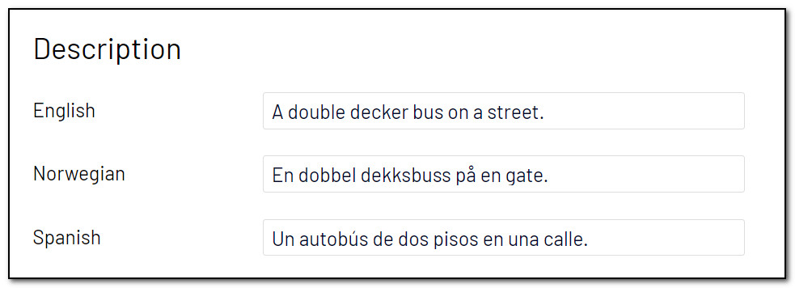

In a multi-lingual site, you may [use different languages](Localization.md).

## Supported properties
The different attributes may be added to different property types. [The property that runs OCR](./attributes/AnalyzeImageForOcr.md) (Optical Character Recognition) on images, can only be added to plain `string` properties only.

The attribute that detects faces can be added to different properties. See the examples below.

``` C#
[AnalyzeImageForFaces]
public virtual bool Bool { get; set; }

[AnalyzeImageForFaces]
public virtual int Integer { get; set; }

[AnalyzeImageForFaces]
public virtual string String { get; set; }

[AnalyzeImageForFaces]
public virtual IList<string> StringList { get; set; }

[AnalyzeImageForFaces(TranslationLanguage.AllActive)]
public virtual IList<LocalizedString> LocalizedString { get; set; }

[AnalyzeImageForFaces(TranslationLanguage.AllActive)]
public virtual IList<LocalizedStringList> LocalizedStringList { get; set; }
```

### Bool
Added to a bool property, the property value will be set to value true/false indicating if the image contains faces or not.

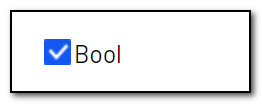

### Int
Added to an int property, the property value will be set to the number of faces present in the image.

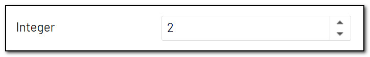

### String
Added to a string property, the property value will be set to a comma-separated list of gender and age for the detected faces.

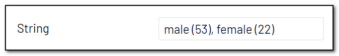

### IList&lt;string&gt;
Added to a string list property (`IList<string>`), the property value will be set to a list of gender and age for the detected faces.

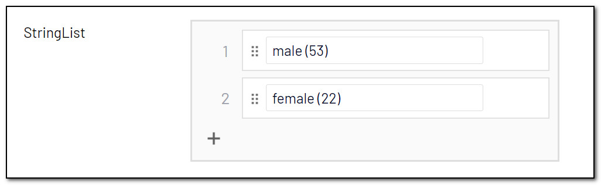

### IList&lt;LocalizedString&gt;
Added to a `IList<LocalizedString>` property, the property value will be set to a comma-separated list of gender and age for the detected faces, one list for all available (or specified) language. [Read more about Localization](Localization.md).

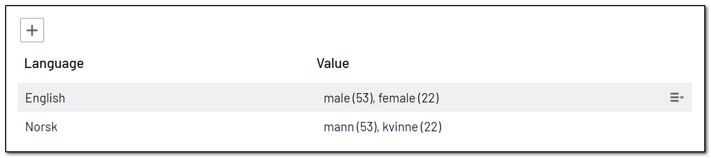

Each row will contain a string with a comma-separated list of faces.
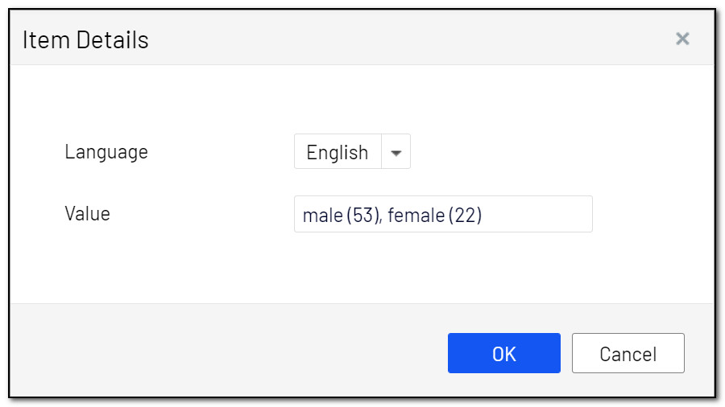

And the dropdown will contain all languages activated for your site.
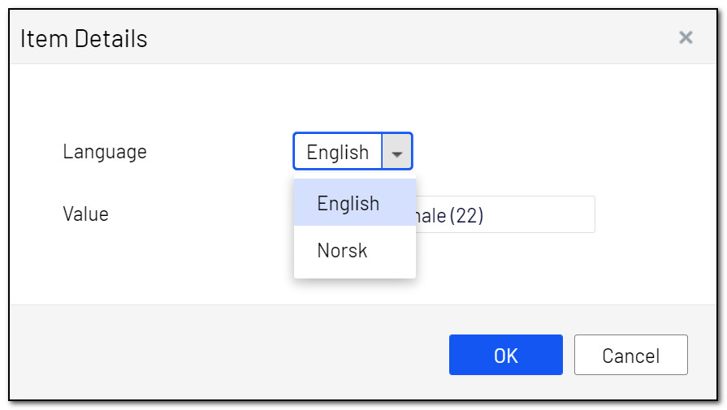

### IList&lt;LocalizedStringList&gt;
Added to a `IList<LocalizedStringList>` property, the property value will be set to a comma-separated list of gender and age for the detected faces, one list for all available (or specified) language. [Read more about Localization](Localization.md).

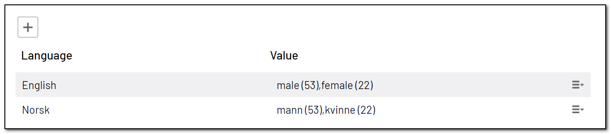

Each row will contain a list of faces.
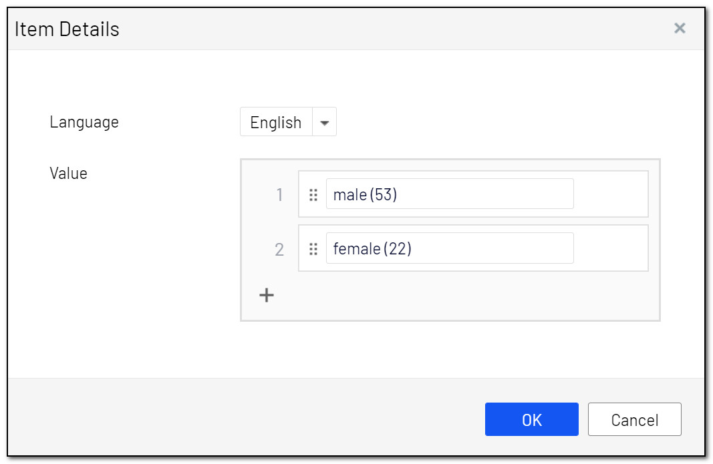

And the dropdown will contain all languages activated for your site.
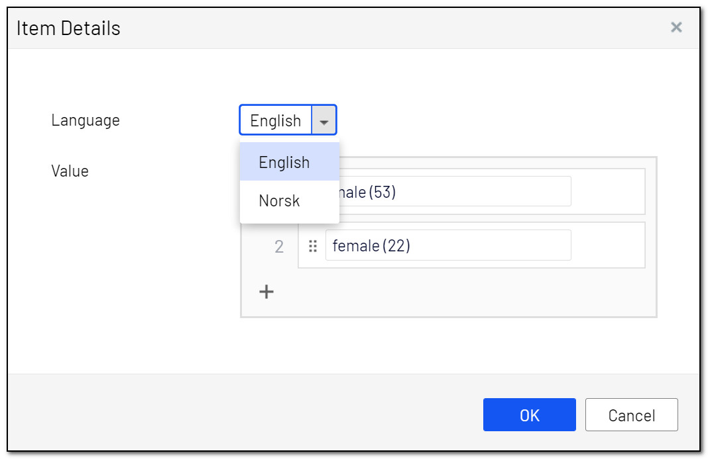

[<< Back to readme](../README.md)