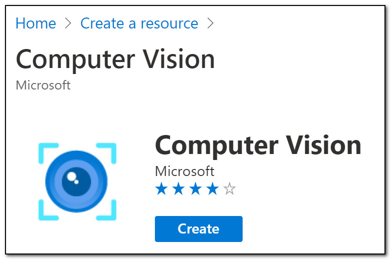
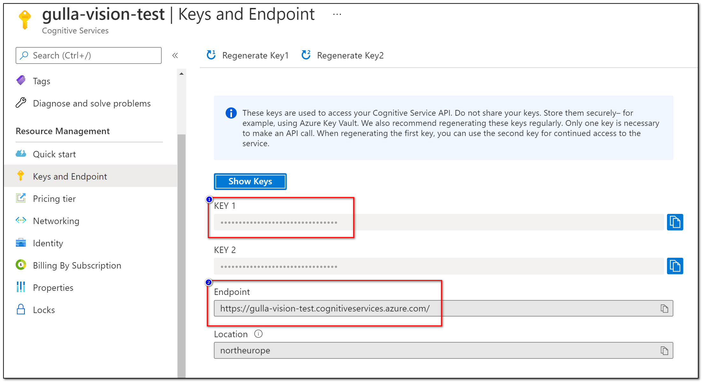
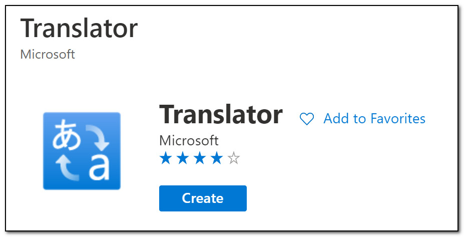
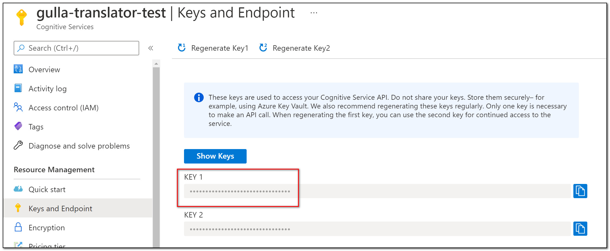

# Gulla.Episerver.AutomaticImageDescription

## 1. Install the addon
The [NuGet package](https://nuget.episerver.com/package/?id=Gulla.Episerver.AutomaticImageDescription) is available on https://nuget.episerver.com/

## 2. Create a Computer Vision resource
In the Azure portal, create a new resource. Search for «Computer Vision», select pricing tier and create.



## 3. Add Computer Vision Key and Endpoint to config



After the resource is created, locate «Keys and Endpoint» in the left pane and add them to the `<appsettings>` setction of web.config like this.
``` XML
<appSettings>
  <add key="Gulla.Episerver.AutomaticImageDescription:ComputerVision.SubscriptionKey" value="key1" />
  <add key="Gulla.Episerver.AutomaticImageDescription:ComputerVision.Endpoint" value="https://endpoint.com" />
</appSettings>

```

## 3. Create a Translator resource
If you are happy with English metadata, you may skip step 3 and 4. If you want your metadata translated to other languages you will need to create a Translator resource. Search for «Translator», select pricing tier and create.




## 4. Add Translator Key to config



After the resource is created, locate «Keys and Endpoint» in the left pane and add the key to the `<appsettings>` setction of web.config like this.
``` XML
<appSettings>
    <add key="Gulla.Episerver.AutomaticImageDescription:Translator.SubscriptionKey" value="key1" />
</appSettings>

```

## 5. Add Translator Region to config (optional)
Add your location, also known as region. The default is global. This is required if using a Cognitive Services resource.
``` XML
<appSettings>
    <add key="Gulla.Episerver.AutomaticImageDescription:Translator.SubscriptionRegion" value="YOUR_RESOURCE_LOCATION" />
</appSettings>

```

Now, you are ready to generate metadata!
The next step is to add some [Attributes](https://docs.microsoft.com/en-us/azure/cognitive-services/translator/quickstart-translator?tabs=csharp) to your image model!

[<< Back to readme](../README.md)