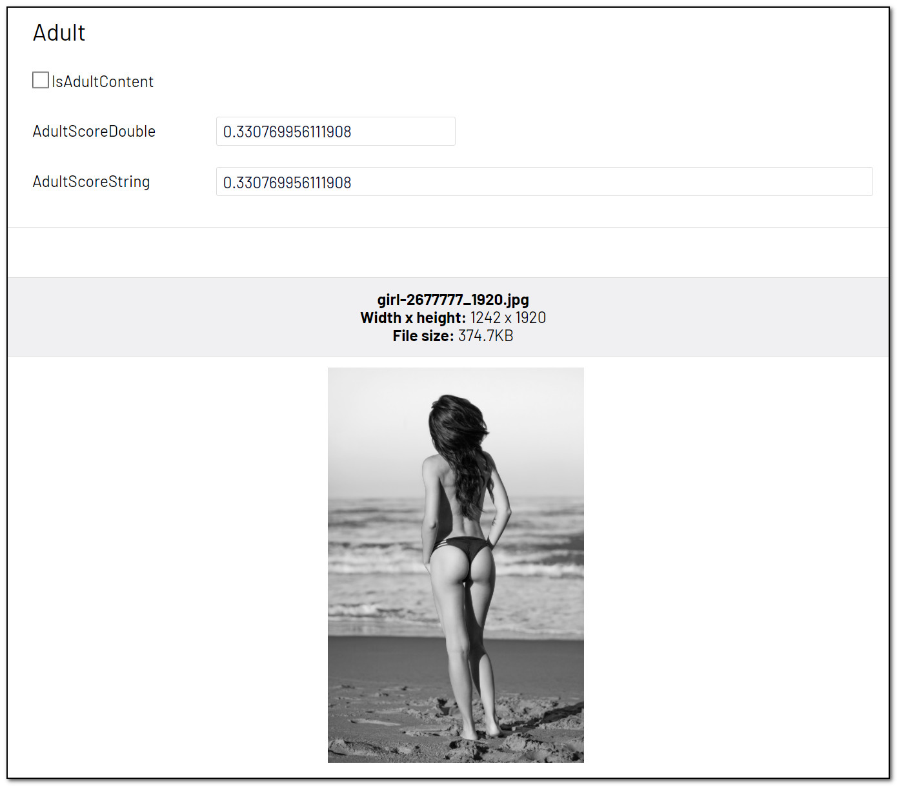

# [AnalyzeImageForAdultContent]
This attribute will try to identify adult content. [Adult images](https://docs.microsoft.com/en-us/azure/cognitive-services/computer-vision/concept-detecting-adult-content) are defined as those which are explicitly sexual in nature and often depict nudity and sexual acts.

May be added to the following property types:

- Bool: True/false indicating if the image has adult content.
- Double: A value ranging from 0.0 to 1.0 indicating Adult Score.
- String: A value ranging from 0.0 to 1.0 indicating Adult Score.

**Example**
``` C#
public class AdultBlock : BlockData
{
    [AnalyzeImageForAdultContent]
    public virtual bool IsAdultContent { get; set; }

    [AnalyzeImageForAdultContent]
    public virtual double AdultScoreDouble { get; set; }

    [AnalyzeImageForAdultContent]
    public virtual string AdultScoreString { get; set; }
}
```
