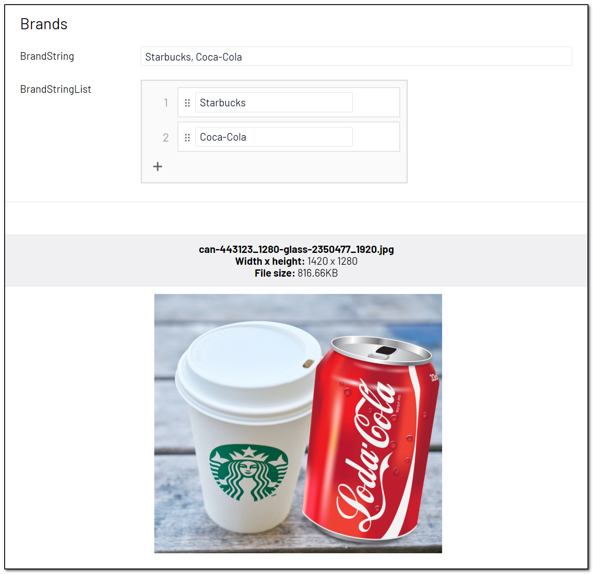

# [AnalyzeImageForBrands]
This attribute will try to identify brands in the image. [Brand detection](https://docs.microsoft.com/en-us/azure/cognitive-services/computer-vision/concept-brand-detection) is a specialized mode of object detection that uses a database of thousands of global logos to identify commercial brands.

May be added to the following property types:

- String: A comma separated list of brands.
- IList&lt;string&gt;: A list of brands.

**Example**
``` C#
public class BrandBlock : BlockData
{
    [AnalyzeImageForBrands]
    public virtual string BrandString { get; set; }

    [AnalyzeImageForBrands]
    public virtual IList<string> BrandStringList { get; set; }
}
```
