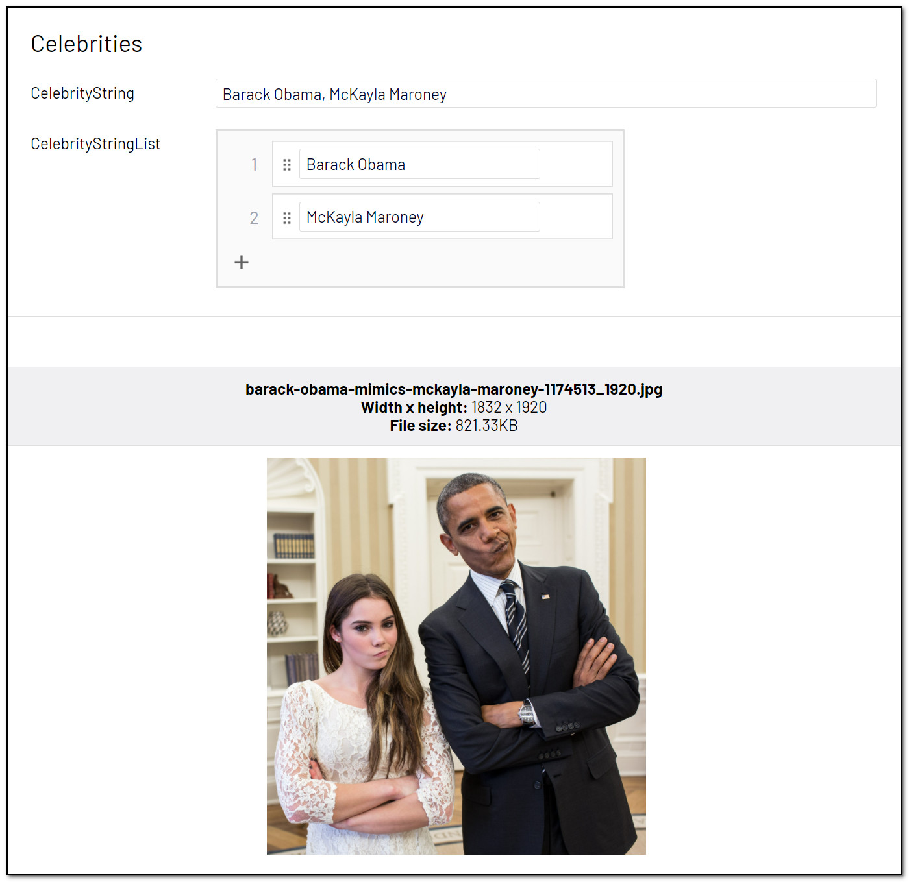

# [AnalyzeImageForCelebrities]
This attribute will try to identify and name [celebrities](https://docs.microsoft.com/en-us/azure/cognitive-services/computer-vision/concept-detecting-domain-content) present in the image.

May be added to the following property types:

- String: A comma separated list of celebrities.
- IList<string>: A list of celebrities.

**Example**
``` C#
public class CelebrityBlock : BlockData
{
    [AnalyzeImageForCelebrities]
    public virtual string CelebrityString { get; set; }

    [AnalyzeImageForCelebrities]
    public virtual IList<string> CelebrityStringList { get; set; }
}
```
