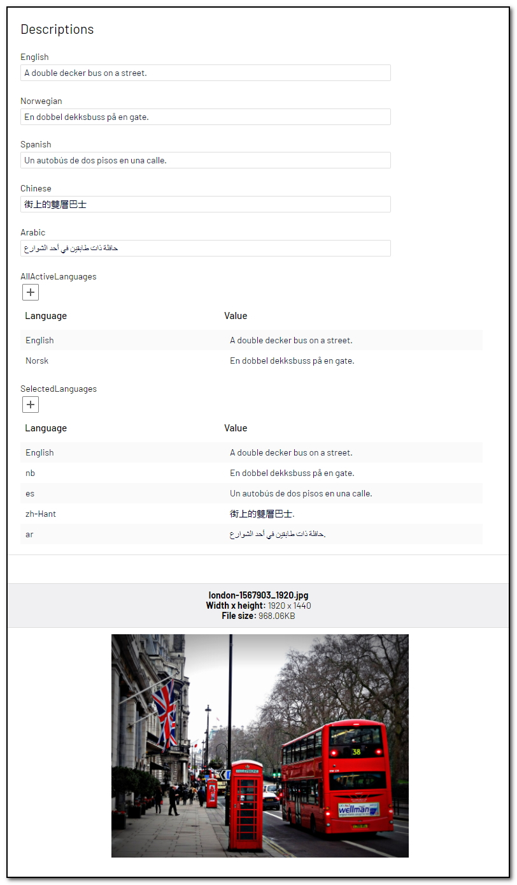

# [AnalyzeImageForDescription]
This attribute will [describe the image](https://docs.microsoft.com/en-us/azure/cognitive-services/computer-vision/concept-describing-images) in a human-readable language. Suitable for captions and alt texts.

May be added to the following property types:

- **String:** A description of the image.
- **IList&lt;LocalizedString&gt;:** A description of the image in one or more languages.

**Example**
``` C#
    public class DescriptionBlock : BlockData
    {
        [AnalyzeImageForDescription]
        public virtual string English { get; set; }

        [AnalyzeImageForDescription(TranslationLanguage.Norwegian)]
        public virtual string Norwegian { get; set; }

        [AnalyzeImageForDescription(TranslationLanguage.Spanish)]
        public virtual string Spanish { get; set; }

        [AnalyzeImageForDescription(TranslationLanguage.ChineseTraditional, false, false)]
        public virtual string Chinese { get; set; }

        [AnalyzeImageForDescription(TranslationLanguage.Arabic, false, false)]
        public virtual string Arabic { get; set; }

        [AnalyzeImageForDescription(TranslationLanguage.AllActive)]
        public virtual IList<LocalizedString> AllActiveLanguages { get; set; }

        [AnalyzeImageForDescription("en,nb,es,zh-Hant,ar")]
        public virtual IList<LocalizedString> SelectedLanguages { get; set; }
    }
```
