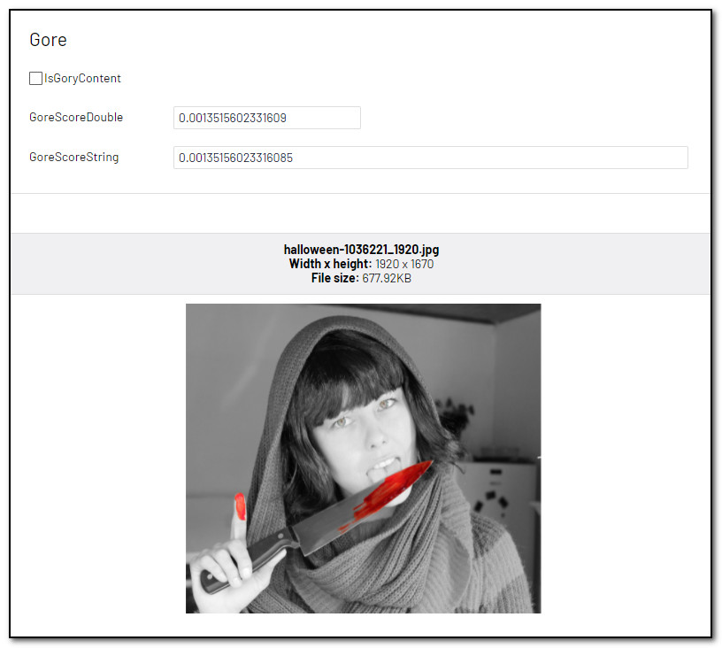

# [AnalyzeImageForGoryContent]
This attribute will try to identify [gory content](https://docs.microsoft.com/en-us/azure/cognitive-services/computer-vision/concept-detecting-adult-content). Gory images show blood/gore.

May be added to the following property types:

- **Bool:** True/false indicating if the image has gory content.
- **Double:** A value ranging from 0.0 to 1.0 indicating Gore Score.
- **String:** A value ranging from 0.0 to 1.0 indicating Gore Score.

**Example**
``` C#
public class GoryBlock : BlockData
{
    [AnalyzeImageForGoryContent]
    public virtual bool IsGoryContent { get; set; }

    [AnalyzeImageForGoryContent]
    public virtual double GoreScoreDouble { get; set; }

    [AnalyzeImageForGoryContent]
    public virtual string GoreScoreString { get; set; }
}
```
