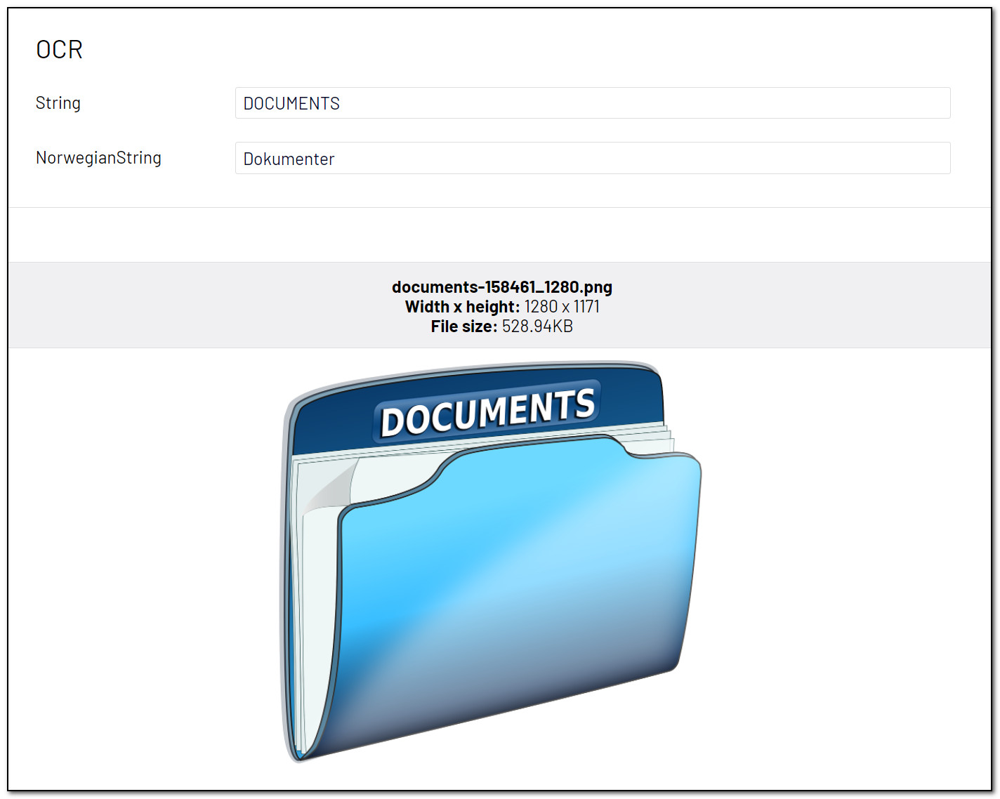

# [AnalyzeImageForOcr]
This attribute will use OCR ([Optical Character Recognition](https://learn.microsoft.com/en-us/azure/ai-services/computer-vision/overview-ocr)) to identify words written in the image. It uses the Azure Image Analysis 4.0 Read feature, which recognizes both printed and handwritten text in [many languages](https://learn.microsoft.com/en-us/azure/ai-services/computer-vision/language-support). It is optimized for general images rather than large, text-heavy documents.

May be added to the following property types:

- **String:** A string containing the OCR result.

**Parameters**
- **toLanguage:** Per default, the OCR result will be presented in the same language as the image. If you want, you may choose to translate it to another language. Passing a parameter from the TranslationLanguage-class, you may choose between about 60 different languages. Optional.
- **fromLanguage:** If you do not specify the origin language, Azure Cognitive Services will try to detect the language. If you know all images will have text in the same language, you may specify the origin langue for better translations results, especially for shorter texts. Optional.

**Example**
``` C#
public class OcrBlock : BlockData
{
    [AnalyzeImageForOcr]
    public virtual string String { get; set; }

    [AnalyzeImageForOcr(TranslationLanguage.Norwegian)]
    public virtual string NorwegianString { get; set; }
}
```

[<< Back to list of attributes](../Attributes.md)