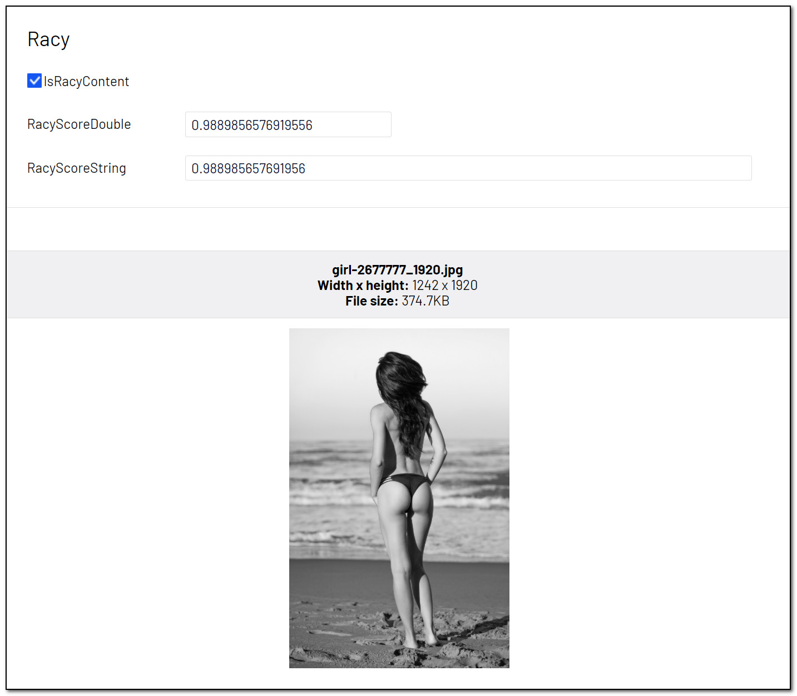

# [AnalyzeImageForAdultContent]
This attribute will try to identify [racy content](https://docs.microsoft.com/en-us/azure/cognitive-services/computer-vision/concept-detecting-adult-content). Racy images are defined as images that are sexually suggestive in nature and often contain less sexually explicit content than images tagged as Adult.

May be added to the following property types:

- **Bool:** True/false indicating if the image has racy content.
- **Double:** A value ranging from 0.0 to 1.0 indicating Racy Score.
- **String:** A value ranging from 0.0 to 1.0 indicating Racy Score.

**Example**
``` C#
public class RacyBlock : BlockData
{
    [AnalyzeImageForRacyContent]
    public virtual bool IsRacyContent { get; set; }

    [AnalyzeImageForRacyContent]
    public virtual double RacyScoreDouble { get; set; }

    [AnalyzeImageForRacyContent]
    public virtual string RacyScoreString { get; set; }
}
```

[<< Back to list of attributes](../Attributes.md)