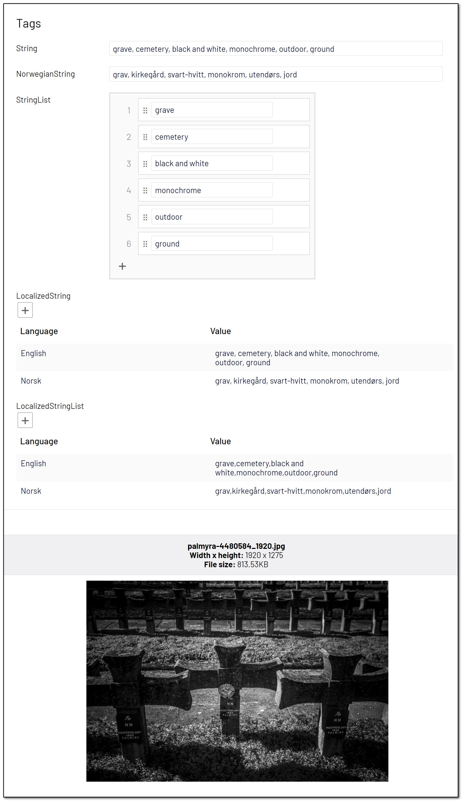

# [AnalyzeImageForTags]
This attribute will return tags that describe the image. Azure Computer Vision returns tags based on thousands of recognizable objects, living beings, scenery, and actions

May be added to the following property types:

- **String:** A comma-separated list of tags.
- **IList&lt;string&gt;:** A list of tags.
- **IList&lt;LocalizedString&gt;:** A comma-separated list of tags, in one or more languages.
- **IList&lt;LocalizedStringList&gt;:** A list of tags, in one or more languages.

**Parameters**
- **languageCode:** Passing a parameter from the TranslationLanguage-class, you may choose between about [60 different languages](https://docs.microsoft.com/en-us/azure/cognitive-services/translator/language-support). Optional. English is default. Combined with `IList<LocalizedString>` or `IList<LocalizedString>` you can use the language code `TranslationLanguage.AllActive` to get translations for all active languages in your Episerver site, or provide a comma separated list of language codes.


**Example**
``` C#
public class TagBlock : BlockData
{
    [AnalyzeImageForTags]
    public virtual string String { get; set; }

    [AnalyzeImageForTags(TranslationLanguage.Norwegian)]
    public virtual string NorwegianString { get; set; }

    [AnalyzeImageForTags]
    public virtual IList<string> StringList { get; set; }

    [AnalyzeImageForTags(TranslationLanguage.AllActive)]
    public virtual IList<LocalizedString> LocalizedString { get; set; }

    [AnalyzeImageForTags(TranslationLanguage.AllActive)]
    public virtual IList<LocalizedStringList> LocalizedStringList { get; set; }
}
```

[<< Back to list of attributes](../Attributes.md)