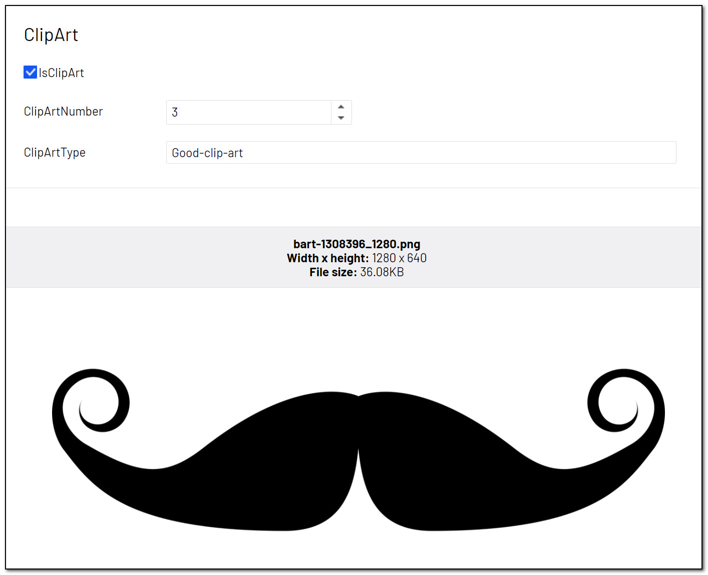

# Creating your own attributes
New attributes may be created inheriting from the abstract base class `BaseImageDetailsAttribute`. You must then override any of the following attributes, to indicate what kind of resources your attribute needs

``` C#
/// <summary>
/// Flag if the Update method needs imageAnalyzerResult to be populated.
/// </summary>
public virtual bool AnalyzeImageContent => false;

/// <summary>
/// Flag if the Update method needs ocrResult to be populated.
/// </summary>
public virtual bool AnalyzeImageOcr => false;

/// <summary>
/// Flag if the Update method needs translationService to be populated.
/// </summary>
public virtual bool RequireTranslations => false;
```

If you rely on data from the Computer Vision API, override `AnalyzeImageContent` and return true. If you rely on OCR data, override `AnalyzeImageOcr` and return true. If you are using the Translation API, override `RequireTranslations` and return true.

Finally implement the `Update` method, where you inspect the image analysis result and update the property decorated with your attribute.

## An example implementation of a custom attribute
This attribute will analyze the image and check if it's a Clip Art. The attribute may be added to three different property types.

``` C#
/// <summary>
/// Analyze image for gory content. Apply to bool properties for true/false or double/string for gory score.
/// Gory images show blood/gore.
/// </summary>
public class AnalyzeImageForGoryContentAttribute : BaseImageDetailsAttribute
{
    public override bool AnalyzeImageContent => true;

    public override void Update(
        PropertyAccess propertyAccess, 
        ImageAnalysis imageAnalyzerResult,
        OcrResult ocrResult,
        TranslationService translationService)
    {
        if (imageAnalyzerResult.Adult == null)
        {
            return;
        }

        if (IsBooleanProperty(propertyAccess.Property))
        {
            propertyAccess.SetValue(imageAnalyzerResult.Adult.IsGoryContent);
        }
        else if (IsDoubleProperty(propertyAccess.Property))
        {
            propertyAccess.SetValue(imageAnalyzerResult.Adult.GoreScore);
        }
        else if (IsStringProperty(propertyAccess.Property))
        {
            propertyAccess.SetValue(imageAnalyzerResult.Adult.GoreScore.ToString(CultureInfo.InvariantCulture));
        }
    }
}
```

**Example**
``` C#
public class ClipArtBlock : BlockData
{
    [AnalyzeImageForClipArt]
    public virtual bool IsClipArt { get; set; }

    [AnalyzeImageForClipArt]
    public virtual int ClipArtNumber { get; set; }

    [AnalyzeImageForClipArt]
    public virtual string ClipArtType { get; set; }
}
```
